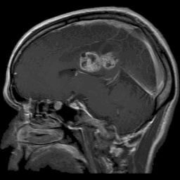
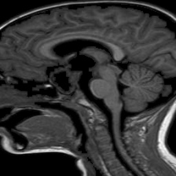
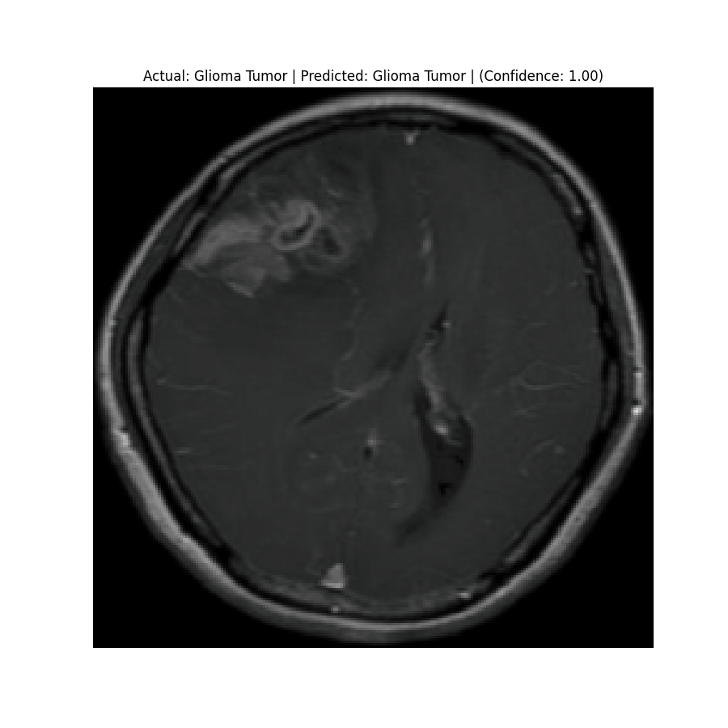
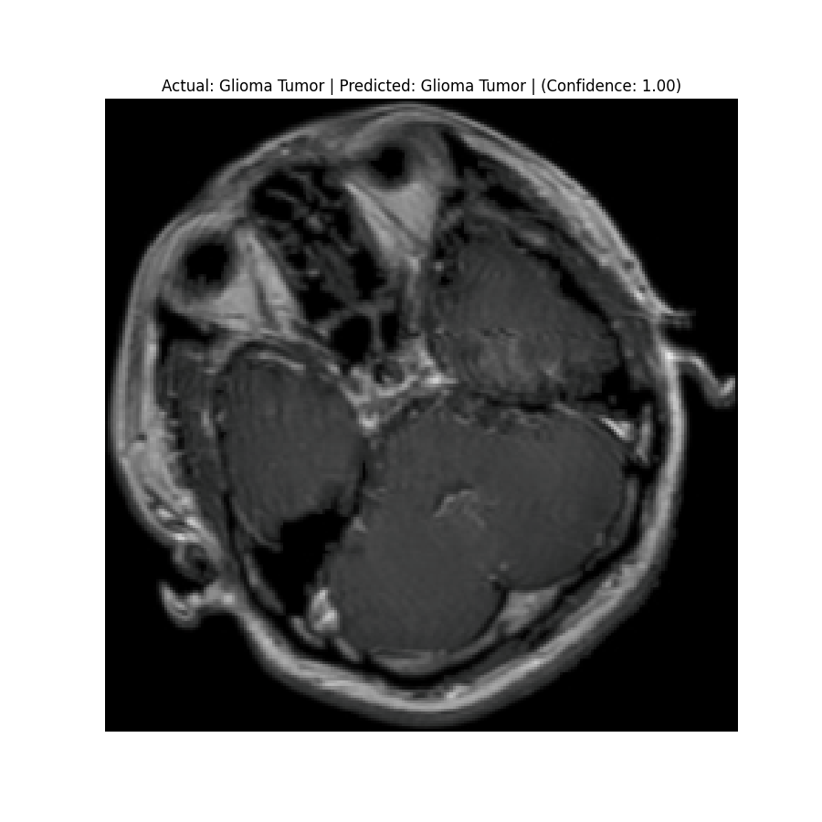
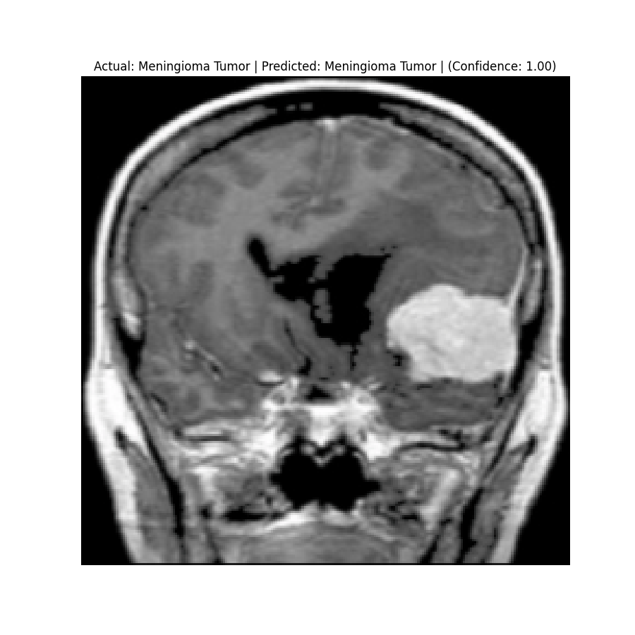
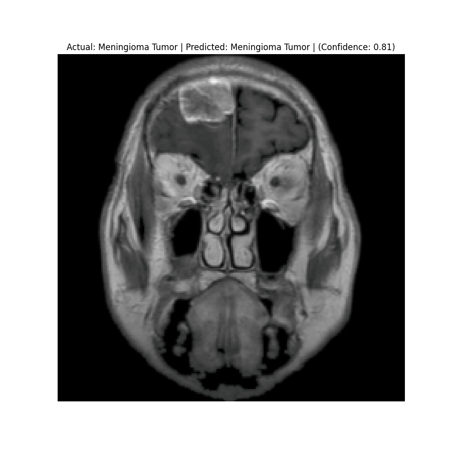
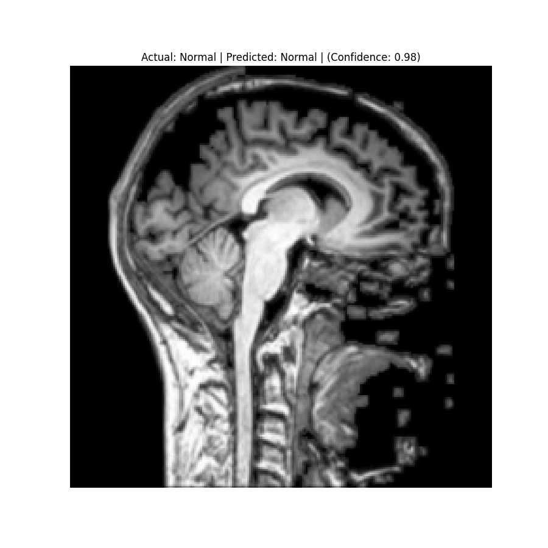
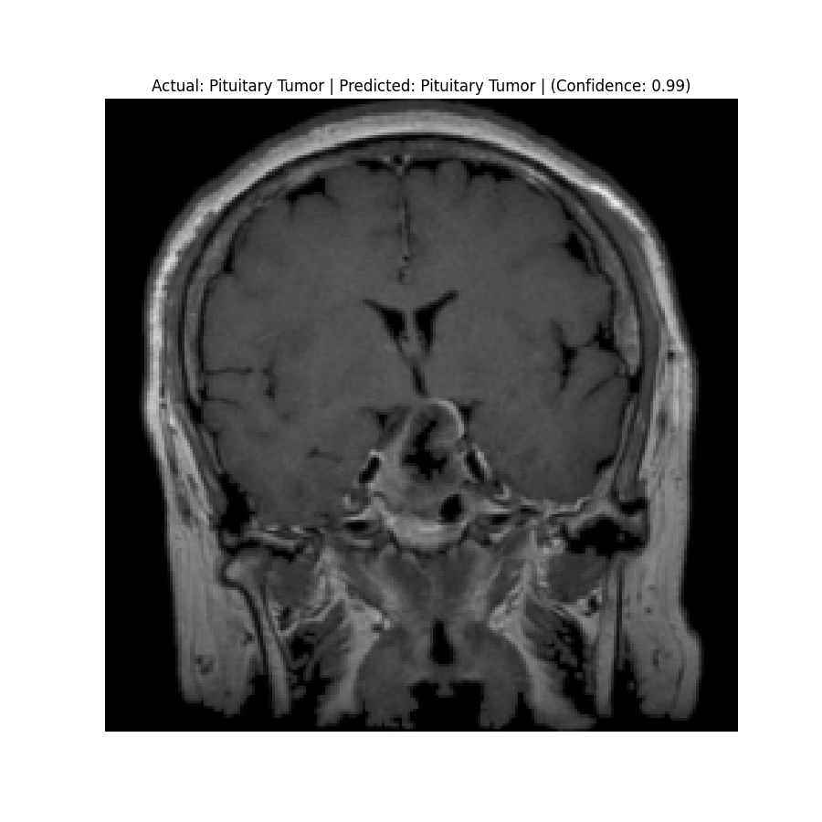
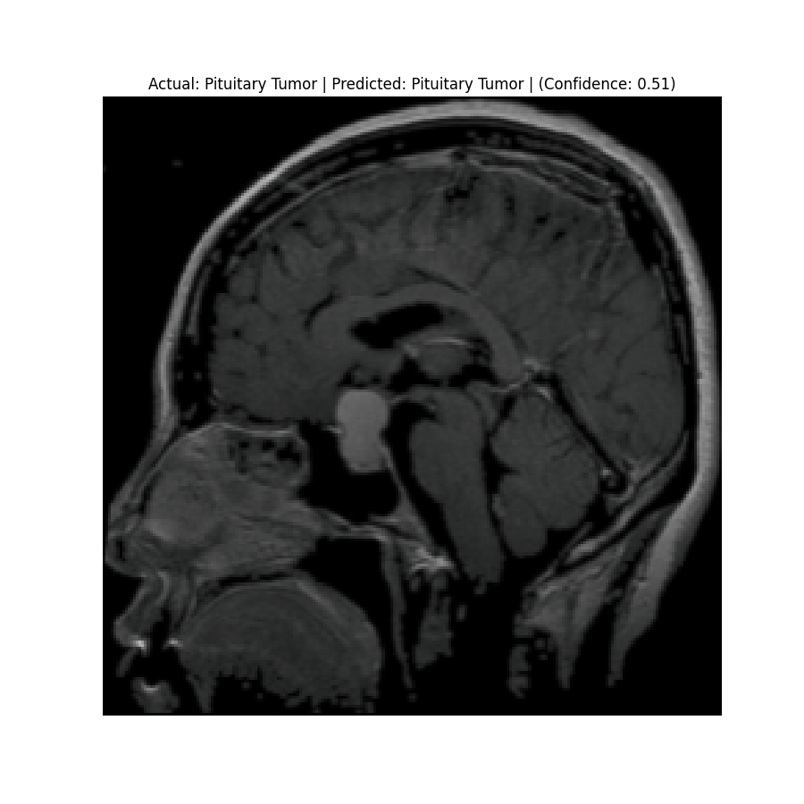
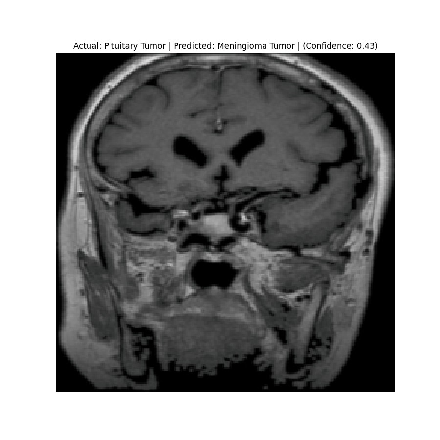

# Brain Tumor 🧠 Classification with Docker Compose 🐳 and PyTorch Lightning ⚡ 

This project demonstrates how to set up training, evaluation, and inference for **Brain Tumor Classification** using Docker and PyTorch Lightning. We employ Docker containers for environment consistency, and [PyTorch Lightning](https://lightning.ai/docs/pytorch/stable/) for structured, modular training, evaluation, and inference processes. The dataset used in this project is the [Brain Tumor Classification (MRI)](https://www.kaggle.com/datasets/sartajbhuvaji/brain-tumor-classification-mri) dataset, managed through Docker Compose.

<div align="center">
  
</div>

## Table of Contents
- [Requirements](#requirements-)
- [Dataset](#dataset-)
- [PyTorch Lightning Module](#pytorch-lightning-module-)
  - [Why PyTorch Lightning?](#why-pytorch-lightning-)
- [Docker Setup](#docker-setup-)
  - [DevContainer](#devcontainer-)
  - [Docker Compose Services](#docker-compose-services-)
- [Training and Evaluation](#training-and-evaluation-)
- [Inference](#inference-)
- [Running Docker Containers](#running-docker-containers-)
- [Results](#results-)
- [References](#references-)

## Requirements 📦

This project requires the following packages to be installed:

- `PyTorch`
- `torchvision`
- `PyTorch Lightning`
- `NumPy`
- `scikit-learn`
- `TensorBoard`
- `Matplotlib`

## Dataset 📂

The dataset used in this project is the [Brain Tumor Classification (MRI)](https://www.kaggle.com/datasets/sartajbhuvaji/brain-tumor-classification-mri). It consists of MRI scans categorized into four classes: 👇

<table>
  <tr>
    <td><b>Glioma Tumor</b></td>
    <td><b>Meningioma Tumor</b></td>
  </tr>
  <tr>
    <td><b>Normal</b></td>
    <td><b>Pituitary Tumor</b></td>
  </tr>
</table>

Each class is stored in separate directories, allowing for easy management and access during the training and evaluation process.

## PyTorch Lightning Module ⚡

PyTorch Lightning simplifies the training process by modularizing the code and separating concerns. It helps you focus more on the logic of your models instead of boilerplate code.

### Why PyTorch Lightning?

✅ **Simplified Code Structure:** It encourages clean and organized code, making it easier to maintain and scale.

✅ **Flexibility:** It allows for an easy switch between different training strategies (such as multi-GPU training, TPU support, etc.) with minimal changes.

✅ **Built-in Features:** It includes built-in logging, checkpointing, and early stopping, reducing manual implementations.

## Docker Setup 🐳

### DevContainer

The `.devcontainer` setup allows you to develop in a pre-configured environment using VS Code:

```json
{
  "name": "Brain Tumor Classification",
  "dockerFile": "Dockerfile",
  "settings": {
    "terminal.integrated.shell.linux": "/bin/bash"
  },
  "extensions": [
    "ms-python.python",
    "ms-azuretools.vscode-docker"
  ],
  "postCreateCommand": "pip install -r requirements.txt"
}
```

### Docker Compose Services

The Docker Compose file defines three services: `train`, `evaluate`, and `infer`:

```yaml
version: '3.8'

services:
  train:
    # Train service
    build:
      context: .
      dockerfile: Dockerfile.train
    shm_size: "2gb"
    volumes:
      - host:/opt/mount
      - ./model:/opt/mount/model
      - ./data:/opt/mount/data

  evaluate:
    # Evaluate service
    build:
      context: .
      dockerfile: Dockerfile.eval
    volumes:
      - host:/opt/mount
      - ./model:/opt/mount/model
      - ./data:/opt/mount/data

  infer:
    # Inference service
    build:
      context: .
      dockerfile: Dockerfile.infer
    volumes:
      - host:/opt/mount
      - ./model:/opt/mount/model
      - ./data:/opt/mount/data
      - ./predictions:/opt/mount/results

volumes:
  host:
```

## Training and Evaluation

To set up and execute the training, evaluation, and inference processes, follow these steps:

1️⃣ **Build Docker Images**: 

- Build the Docker images for all services using:

   ```bash
   docker compose build
   ```

2️⃣ **Train the Model**: 

- To train the model, run:

   ```bash
   docker compose run train
   ```

- The `BrainTumorClassifier` will train the model and save the checkpoints in the shared volume.

3️⃣ **Evaluate the Model**: 

- To evaluate the model, execute:

   ```bash
   docker compose run evaluate
   ```

- This will load the saved checkpoint and print the validation metrics using `eval.py`.

## Inference 🔍

To run inference on sample images:

```bash
docker compose run infer
```

- The `infer.py` script will predict the labels for 10 random images and save the output to the `predictions` directory.

Each service uses **volume mounts** to ensure that data, checkpoints, and results are accessible across different containers, maintaining consistency.

## Results 📊

Check the predictions in the `predictions` folder. Below are some sample results:

<table>
  <tr>
    <td><div style="text-align: center;"><br>Actual: Glioma Tumor <br> Predicted: Glioma Tumor <br> (Confidence: 1.00)</div></td>
    <td><div style="text-align: center;"><br>Actual: Glioma Tumor <br> Predicted: Glioma Tumor <br> (Confidence: 1.00)</div></td>
  </tr>
  <tr>
    <td><div style="text-align: center;"><br>Actual: Meningioma Tumor<br> Predicted: Meningioma Tumor <br> (Confidence: 1.00)</div></td>
    <td><div style="text-align: center;"><br>Actual: Meningioma Tumor<br> Predicted: Meningioma Tumor <br> (Confidence: 0.81)</div></td>
  </tr>
  <tr>
    <td><div style="text-align: center;"><br>Actual: Normal <br> Predicted: Normal <br> (Confidence: 0.98)</div></td>
    <td><div style="text-align: center;"><br>Actual: Pituitary Tumor <br> Predicted: Pituitary Tumor <br> (Confidence: 0.99)</div></td>
  </tr>
  <tr>
    <td><div style="text-align: center;"><br>Actual: Pituitary Tumor <br> Predicted: Pituitary Tumor <br> (Confidence: 0.51)</div></td>
    <td><div style="text-align: center;"><br>Actual: Pituitary Tumor<br> Predicted: Meningioma Tumor <br> (Confidence: 0.43)</div></td>
  </tr>
</table>

## References 🔗

- [Brain Tumor Classification (MRI) Dataset on Kaggle](https://www.kaggle.com/datasets/sartajbhuvaji/brain-tumor-classification-mri)
- [PyTorch](https://pytorch.org/)
- [PyTorch Lightning](https://www.pytorchlightning.ai/)
- [Docker Documentation](https://docs.docker.com/)
